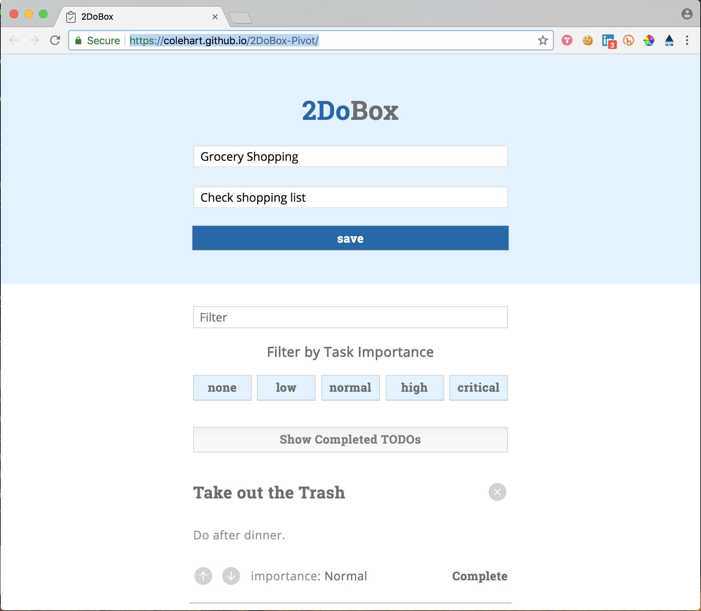

# [2DoBox-Pivot](http://frontend.turing.io/projects/2DoBox-Pivot-Mod1.html)
## An task collection app built with jQuery

Assignment specs can be found [here](http://frontend.turing.io/projects/2DoBox-Pivot-Mod1.html).

